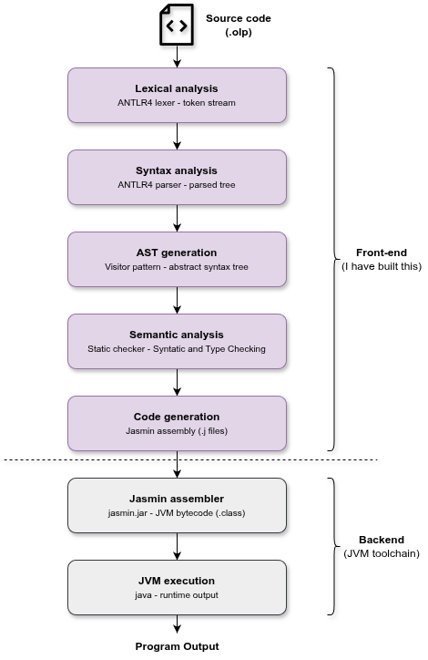

# OPLang Compiler — Compiler as a Service

[](https://www.python.org/)
[](https://www.antlr.org/)
[](https://fastapi.tiangolo.com/)
[](https://www.docker.com/)
[](https://azure.microsoft.com/)

> A full compiler implementation for **OPLang** — deployed as a cloud-hosted **Compiler-as-a-Service** with an online IDE. Built for CO3005 Principle of Programming Languages, HCMUT.

🌐 **Live Demo**: [http://20.2.91.144](http://20.2.91.144)

---

## What is this?

This project started as a standard PPL assignment (Lexer → Parser → AST → Semantic → CodeGen), then extended into a real-world system:

```
Browser (Online IDE)
    │  HTTP / WebSocket
    ▼
FastAPI Web Server          ← receives source code
    │
    ├── Redis Queue         ← task broker
    │
    ▼
Celery Worker               ← executes compiler pipeline
    │
    ▼
ANTLR4 → AST → Semantics → Jasmin → JVM
    │
    ▼
Result / Live Output        ← streamed back to browser
```

---

## Inside the Compiler Pipeline

OPLang is an **Ahead-of-Time (AOT) compiler** — source code is fully compiled to JVM bytecode before execution, similar to how Java/Kotlin work.

The pipeline is divided into two parts: the **front-end** (implemented from scratch in this project) handles everything from reading source code to emitting Jasmin assembly, while the **back-end** is delegated to the JVM toolchain — Jasmin assembler converts `.j` files to `.class` bytecode, then the JVM executes them with JIT optimization at runtime.



---

## Web Service Architecture

| Component | Technology | Role |
|---|---|---|
| Web API | FastAPI + Uvicorn | Receive code submissions |
| Task Queue | Redis + Celery | Async job processing |
| Compiler Worker | Python subprocess | Execute compiler pipeline |
| Interactive Run | WebSocket + asyncio | Live stdin/stdout streaming |
| Frontend | Vanilla JS + CodeMirror | Online IDE with Catppuccin theme |
| Infra | Docker Compose + Nginx | Container orchestration + reverse proxy |
| Cloud | Azure VM (Ubuntu 24.04) | Hosting |

### API Endpoints

| Method | Endpoint | Description |
|---|---|---|
| `POST` | `/submit` | Submit source code, returns `task_id` |
| `GET` | `/result/{task_id}` | Poll compilation result |
| `WS` | `/ws/run` | Interactive run with live stdin/stdout |

---

## OPLang Language

OPLang is a statically-typed, class-based OOP language that compiles to JVM bytecode.

```oplang
class Fibonacci {
    static void main() {
        int a; int b; int c; int i;
        a := 0; b := 1;
        io.writeStrLn("Fibonacci:");
        for i := 1 to 10 do {
            io.writeIntLn(a);
            c := a + b; a := b; b := c;
        }
    }
}
```

Key features: class hierarchy · inheritance · polymorphism · static type checking · `for`/`while`/`if-else` · `int` · `float` · `boolean` · `string` · arrays · references

📖 See [OPLang Specification](oplang_specification.md) for full language reference.

---

## Local Development

### Prerequisites

- Python 3.12+
- Java (JDK 11+)
- Docker + Docker Compose

### Run locally

```bash
# Clone and build
git clone <repo>
cd oplang-compiler
python3 run.py build        # compile ANTLR grammar

# Start all services
docker compose up --build -d

# Open browser
open http://localhost:8000
```

### Run compiler directly

```bash
python3 compiler_main.py input.opl output.txt
cat output.txt
```

### Run tests

```bash
source venv/bin/activate
python3 run.py test-lexer
python3 run.py test-parser
python3 run.py test-ast
python3 run.py test-checker
python3 run.py test-codegen
```

---

## Project Structure

```
oplang-compiler/
├── src/
│   ├── grammar/        # ANTLR4 grammar (OPLang.g4)
│   ├── astgen/         # AST generation visitor
│   ├── semantics/      # Static type checker
│   ├── codegen/        # JVM bytecode generator (Jasmin)
│   ├── runtime/        # io.class + jasmin.jar
│   └── utils/          # AST nodes, error listener
├── build/              # ANTLR4 generated files
├── service/
│   ├── main.py         # FastAPI app + WebSocket endpoint
│   ├── tasks.py        # Celery tasks
│   └── static/         # Frontend (index.html, CSS, JS)
├── tests/              # 500 test cases (lexer/parser/ast/checker/codegen)
├── compiler_main.py    # Compiler entry point
├── docker-compose.yml  # Redis + Web + Worker
├── Dockerfile
└── requirements.txt
```

---

## Deploy to Cloud

```bash
# Sync code to Azure VM
rsync -av --exclude='__pycache__' --exclude='*.pyc' \
    --exclude='.git' --exclude='temp_jobs' \
    -e "ssh -i ~/.ssh/your-key.pem" \
    . azureuser@<VM_IP>:~/oplang-compiler

# SSH into VM and start services
ssh -i ~/.ssh/your-key.pem azureuser@<VM_IP>
cd oplang-compiler
docker compose up --build -d
```

Nginx handles port 80 → forwards to FastAPI on port 8000.

---

## Assignment Breakdown

| Assignment | Description | Status |
|---|---|---|
| A1 | Lexer + Parser (ANTLR4 grammar, 200 tests) | ✅ |
| A2 | AST Generation (visitor pattern, 100 tests) | ✅ |
| A3 | Static Semantic Analysis (type checker, 100 tests) | ✅ |
| A4 | JVM Bytecode Generation (Jasmin, 100 tests) | ✅ |
| Extension | Compiler-as-a-Service on Azure Cloud | ✅ |

---

## License

Educational project — CO3005 Principle of Programming Languages  
Ho Chi Minh City University of Technology (VNU-HCM)
